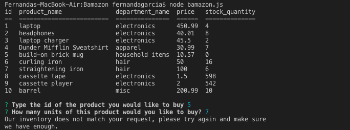

# Bamazon

An amazon-like app from which users can search our database to view our inventory and order their preferred item. 

The app populates the database for the user to view. The user selects the ID # of the item they wish to purchase and the quantity. 

If the quantity selected is available, the order is placed and the user receives the total price information for their order. 

Otherwise, the user is told to select an appropriate quantity and is once again prompted with the database selection. 

# Images in ReadME

      
